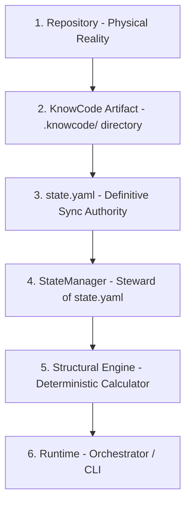

# KnowCode

[](https://www.python.org/)
[](#license)

**KnowCode** is a structural cognition engine for code repositories. It bridges the gap between **physical repository code**, **deterministic structural snapshots**, and **semantic architectural knowledge**, allowing AI agents and human developers to inspect, track, and maintain codebase structures deterministically.

---

## 📖 Table of Contents

- [Overview](#-overview)
- [Key Features](#-key-features)
- [Architecture & Authority Hierarchy](#-architecture--authority-hierarchy)
- [Ecosystem Layout (`.knowcode`)](#-ecosystem-layout-brain)
- [Installation](#-installation)
- [Usage & CLI Reference](#-usage--cli-reference)
- [License](#-license)

---

## 🔍 Overview

KnowCode partitions codebase understanding into three clean domains:
1. **Physical Reality:** The actual source files inside the repository.
2. **Structural Truth:** Deterministic representation of files, components, and code symbols parsed via abstract syntax trees (ASTs).
3. **Semantic Knowledge:** Human-authored or AI-generated documentation, rules, and architectural guidelines that provide meaning and context.

By analyzing the structure, KnowCode computes a deterministic state and exposes it to orchestrators through a unified CLI. 

**Retroactive Context Distillation:**
KnowCode completely flips the traditional documentation model. Instead of forcing developers to write specs *before* they code, KnowCode uses an AI agent to track your intent during a development session. When you sync your physical code changes, the AI agent is automatically invoked to synthesize your intent against the deterministic reality of the codebase, ensuring your architectural knowledge naturally accumulates as a byproduct of development.

---

## ✨ Key Features

- 🌲 **Multi-Language AST Parsing**: Built on top of `tree-sitter`, with out-of-the-box support for **Python**, **JavaScript**, and **TypeScript**.
- 🔄 **Deterministic State & Revision Tracking**: Tracks codebase changes across sequential revisions (`S-001`, `S-002`, etc.) written to an authoritative state registry.
- 🔀 **Diff & Report Generation**: Automatically computes additions, deletions, line-boundary modifications, and maps changes to their top-level affected components.
- 🛠️ **Zero-Bypassing State Stewardship**: The engine handles updating all structural fields within `state.yaml` while preserving semantic metadata (such as `semantic_revision`).

---

## 🏛️ Architecture & Authority Hierarchy

KnowCode operates under a strict, cascading chain of truth. No system layer is permitted to bypass the layers above it:



1. **Repository:** The ultimate physical source of truth.
2. **KnowCode Artifact:** The reflection of that reality (`.knowcode/` directory).
3. **`state.yaml`:** The definitive metadata and synchronization authority.
4. **`StateManager`:** The steward managing structural fields inside `state.yaml`.
5. **Structural Engine:** The deterministic calculator of ASTs and changes.
6. **Runtime:** The thin orchestration layer that exposes commands to the user.

---

## 📂 Ecosystem Layout (`.knowcode` & `.agent`)

When KnowCode is initialized in a repository, it generates a dual-folder structure:

```text
.knowcode/                        # The Deterministic Knowledge Artifact
├── state.yaml                 # Authoritative state registry (managed by the Engine)
├── structure/
│   └── snapshots/
│       ├── S-001.json         # Deterministic structural snapshots of AST symbols
│       └── ...
├── reports/
│   ├── R-001.md               # Change and diff analysis reports
│   └── ...
├── knowledge/                 # Permanent semantic knowledge (AI synthesized)
│   ├── raw/                   # Inbox for legacy or unstructured documentation
│   ├── architecture.md
│   ├── decisions.md
│   └── ...
└── logs/                      # Subsystem logs and diagnostic information

.agent/                        # The Semantic Governance & Memory Layer
├── KNOWCODE.md                   # Human-readable entrypoint and subsystem overview
├── memory/
│   ├── active_context.md      # The AI's short-term intent tracking buffer
│   └── previous_context.md    # Rolled-over buffer waiting for synthesis
├── skills/
│   └── system/
│       └── context_tracker.md # The Semantic Prime Directive
└── workflows/
```

---

## 🚀 Installation

### Prerequisites
- [Python 3.13+](https://www.python.org/)
- [uv Package Manager](https://github.com/astral-sh/uv)

### Setup
Clone the repository and install it in editable mode:

```bash
# Clone the repository
git clone https://github.com/your-username/knowcode.git
cd knowcode

# Synchronize dependencies and virtual environment
uv sync

# Install KnowCode globally/locally in editable mode
uv pip install -e .
```

---

## 🛠️ Usage & CLI Reference

All interactions are done through the `know` command-line utility.

### 1. Initialize the Brain
To scaffold the `.knowcode/` directory and create the initial baseline snapshot (`S-001`) of your repository:

```bash
know .
```

### 2. View Current Status
To view the status of the know instance, including the current structural/semantic revision, snapshot reference, and synchronization metadata:

```bash
know status
```

*Example Output:*
```text
┌─────────────────────────────────────────────────────────────┐
│                 KnowCode Status: /path/to/repo                 │
├──────────────────────┬──────────────────────────────────────┤
│ Initialized          │ Yes                                  │
│ Structural Revision  │ S-001                                │
│ Semantic Revision    │ none                                 │
│ Current Snapshot     │ .knowcode/structure/snapshots/S-001.yaml│
│ Latest Report        │ .knowcode/reports/R-001.yaml            │
│ Last Sync            │ 2026-06-20 14:30:00 UTC              │
└──────────────────────┴──────────────────────────────────────┘
```

### 3. Synchronize Structural State
Scan the repository for structural changes. If modifications are detected, KnowCode writes a new snapshot (`S-002`, `S-003`, etc.), documents the structural differences in a report, and automatically rolls over the `active_context.md` memory buffer:

```bash
know sync
```

* If there are no structural changes, KnowCode returns immediately with a `No structural changes detected` shortcut and does not write a new snapshot.

### 4. Synchronize Semantic Knowledge
After a structural sync, the Semantic Agent synthesizes the rolled-over `previous_context.md` with the structural report. Once the Agent commits the architectural updates to `.knowcode/knowledge/`, run this command to safely bump the semantic revision (`M-001`) and flush the memory buffer:

```bash
know sync-semantic
```

### 5. Ingest Legacy Knowledge
If you have legacy PDFs, markdown files, or unstructured documentation, drop them into the `.knowcode/knowledge/raw/` inbox. Ask the Semantic Agent to read and synthesize them into your knowledge base. Once complete, officially ingest the file to safely delete it and bump the semantic revision:

```bash
# Ingest a specific file
know ingest-semantic .knowcode/knowledge/raw/legacy-docs.pdf

# Or ingest and wipe the entire inbox at once
know ingest-semantic .
```

---

## 📄 License

This project is licensed under the MIT License. See the [LICENSE](LICENSE) file for details.
